# RFC — LAJE App: Gestão e Divulgação de Campeonatos Universitários

**Engenharia de Software – Católica SC**

---

# Identificação

- **Título do Projeto:**  
  LAJE App

- **Linha de Projeto (Direction):**  
  Web Apps

- **Autor:**  
  João Paulo Duarte Xavier

- **Data da Proposta:**  
  08/04/2026

- **Versão:**  
  1.0

---

# 1. Visão do Produto e Impacto (O Problema)

O LAJE App é uma aplicação web voltada à gestão operacional e à divulgação pública de campeonatos universitários organizados pela Liga das Atléticas de Joinville (LAJE). A proposta do projeto consiste em centralizar, em um único sistema, a administração de jogos, classificações, chaveamentos, agenda e eventos institucionais, além de disponibilizar essas informações ao público de forma estruturada e atualizada em tempo quase real.

Atualmente, o projeto já possui base funcional implementada no repositório, bem como documentação técnica organizada em `README`, diretório `docs/` e Wiki do GitHub. No estado atual, a aplicação opera com frontend React integrado ao ecossistema Supabase, utilizando autenticação, persistência e atualização em tempo real por meio da plataforma. Nesta RFC, o **estado atual comprovado** é a referência principal do documento. Quando necessário, o texto também registra o **estado-alvo** como direção de evolução arquitetural, sem tratar como entrega concluída aquilo que ainda permanece em refatoração ou planejamento.

---

## 1.1 Contexto e Problema

A organização de campeonatos universitários envolve múltiplos processos que precisam ocorrer de forma coordenada, tais como:

- definição de campeonatos e edições (ano);
- cadastro de modalidades e participantes;
- criação e gestão de partidas;
- operação ao vivo com atualização de placares;
- cálculo de classificação;
- geração e acompanhamento de chaveamentos;
- divulgação pública de agenda, resultados e eventos institucionais.

Quando esses processos são executados de forma fragmentada — por meio de planilhas, mensagens informais, anotações manuais e múltiplas ferramentas desconectadas — surgem problemas recorrentes relacionados à consistência, rastreabilidade e velocidade de atualização.

No contexto da LAJE, os principais problemas identificados são:

1. **Fragmentação da informação**  
   Dados de campeonatos, jogos, classificação e calendário ficam distribuídos em diferentes fontes, dificultando a gestão centralizada.

2. **Atualização tardia das informações públicas**  
   A ausência de um fluxo integrado leva à dependência de atualizações manuais, prejudicando o acompanhamento em tempo real.

3. **Dependência de processos manuais**  
   Operações como atualização de placar, recomputação de classificação e ajustes de agenda demandam retrabalho e aumentam o risco de erro.

4. **Baixa rastreabilidade administrativa**  
   Não há controle claro sobre quem realizou alterações, quando elas ocorreram e qual era o estado anterior dos dados.

5. **Desalinhamento entre operação interna e informação pública**  
   A ausência de uma fonte única de verdade pode gerar inconsistência entre o que a organização registra e o que o público visualiza.

Soluções existentes no mercado tendem a resolver partes do problema, como agenda, chaveamento ou divulgação, mas raramente oferecem integração completa entre operação administrativa, regras de domínio e experiência pública.

O LAJE App propõe uma solução integrada, com base única de dados e fluxos automatizados que conectam operação interna e visualização pública.

**Estado atual do sistema:**
- frontend React já implementado e integrado ao Supabase;
- autenticação administrativa atualmente apoiada em Supabase Auth;
- persistência e regras de domínio atualmente apoiadas em Supabase/Postgres e funções SQL;
- modelagem de campeonatos, jogos, classificação e chaveamento implementada;
- logs de ações administrativas e atualização em tempo real em fluxos relevantes.

**Estado-alvo da entrega:**
- frontend web consumindo API dedicada;
- backend próprio em `Node.js + Express` no repositório `laje-api`;
- banco relacional `PostgreSQL` como fonte principal de persistência;
- infraestrutura pública compatível com a linha de Web Apps, tendo `AWS` como referência inicial de estado-alvo;
- pipeline CI/CD, análise estática, observabilidade e estratégia de testes alinhadas ao Portfólio.

---

## 1.2 Origem da Demanda e Evidências

Este projeto está sendo estruturado como uma solução voltada à comunidade LAJE e ao ecossistema universitário relacionado, caracterizando uma demanda comunitária real, ainda que nesta etapa não exista uma formalização documental de parceiro externo específico anexada à RFC.

### Origem da demanda

A demanda nasce da observação de um cenário recorrente em ligas e campeonatos universitários: a operação esportiva e a comunicação pública dependem de organização manual, ferramentas dispersas e processos pouco integrados. No caso da LAJE, a própria estrutura do domínio já exige:

- gestão de campeonatos com temporadas e status;
- cadastro e manutenção de jogos;
- operação ao vivo com atualização de placar;
- cálculo automático de classificação;
- geração e acompanhamento de chaveamentos;
- calendário institucional da liga;
- controle de acesso administrativo com rastreabilidade.

Esse conjunto de necessidades não caracteriza um exercício técnico abstrato, mas sim um problema operacional concreto, com impacto direto sobre organizadores, operadores, atléticas participantes e público.

### Evidências atuais

Na presente etapa, a evidência adotada para sustentar a demanda é a **dor operacional observada no domínio**, refletida nos artefatos já produzidos e no próprio recorte funcional implementado no projeto. Entre os elementos que reforçam essa evidência estão:

- a documentação funcional já consolidada no repositório;
- a Wiki estruturada por arquitetura, fluxos, regras, funcionalidades e modelagem de dados;
- a presença de fluxos de negócio completos no sistema, como autenticação administrativa, controle ao vivo, classificação automática, chaveamento e calendário da liga;
- a existência de modelagem e regras específicas para o contexto competitivo da LAJE.

Essas evidências demonstram aderência a um problema real do domínio e foram complementadas por validação empírica já realizada com usuários finais em contexto real de uso.

### Evidência empírica já coletada (interações reais — 2026)

Além da análise do domínio e da modelagem funcional já implementada, foram observadas interações reais em grupos da LAJE (ano de 2026) envolvendo membros da organização e participantes da liga durante o uso inicial e apresentação do sistema.

Alguns feedbacks espontâneos registrados incluem:

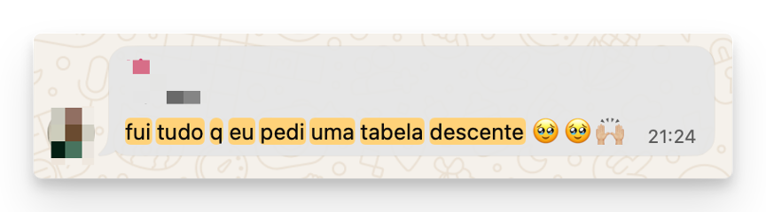
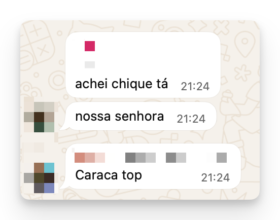
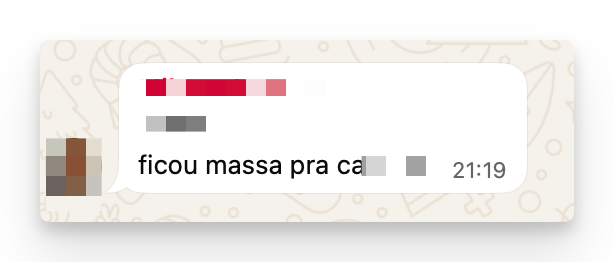

Essas manifestações indicam percepção imediata de valor na organização e visualização das informações, especialmente em relação a tabelas, classificação e estruturação dos dados.

Também houve validação funcional direta de necessidades do sistema:

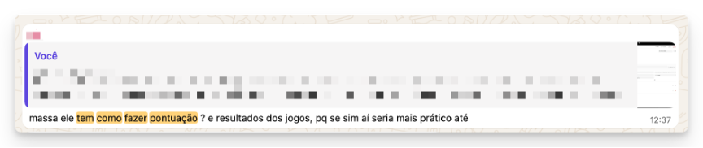

Esse tipo de questionamento reforça que funcionalidades centrais do domínio fazem parte do problema real.

Além disso, foi observada percepção de potencial de expansão do produto:

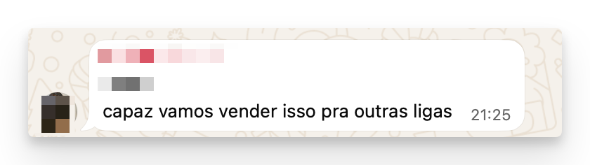

Como ponto de melhoria inicial identificado:

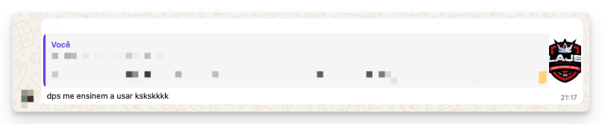

Esse feedback evidencia necessidade de evolução em usabilidade, onboarding ou documentação para operadores.

Embora esses registros não constituam, por si só, um estudo formal de usabilidade, eles funcionam como **evidência empírica já coletada de aderência ao problema e aceitação da solução**, complementando a análise do domínio apresentada nesta RFC.

### Síntese da validação já realizada com usuários finais

Além dos registros qualitativos apresentados acima, esta RFC considera como marcos de validação já realizados:

- validação durante a **Copa Laje de Verão**, com data final registrada em `12/04/2026`;
- validação durante a **Copa Laje Society**, com data final registrada em `21/06/2026`;
- coleta de feedbacks espontâneos preservados em `docs/assets/reviews`;
- confirmação de interesse nas funcionalidades de tabela, pontuação, classificação e organização pública das informações.

Assim, nesta versão do documento, a origem da demanda é registrada como **demanda comunitária da LAJE** sustentada por dor operacional observada e por validação empírica inicial já realizada com usuários finais. Novas rodadas de validação podem ampliar esse conjunto de evidências, mas não são o ponto de partida desta RFC.

---

## 1.3 Análise de Soluções Existentes (Benchmark)

Para avaliar o espaço de solução, foram analisadas plataformas amplamente utilizadas que oferecem recursos relacionados à gestão de torneios, ligas, agenda, chaveamento e acompanhamento público. A comparação abaixo ajuda a identificar o que já existe no mercado e qual lacuna o LAJE App pretende atender de forma mais aderente ao seu nicho.

| Solução | Link | Público-alvo | Funcionalidades principais | Limitações em relação ao nicho LAJE |
|---|---|---|---|---|
| SportsEngine Tourney | [tourneymachine.com](https://www.tourneymachine.com/) | Organizadores de torneios esportivos, equipes e famílias | Agenda, brackets, standings, resultados e app móvel para acompanhamento | Foco amplo em torneios esportivos; não é orientado especificamente ao contexto institucional da LAJE nem à gestão integrada de calendário da liga, permissões administrativas customizadas e regras específicas do domínio universitário local |
| LeagueApps Tournaments | [leagueapps.com/tournaments](https://leagueapps.com/tournaments/) | Organizações esportivas, clubes e torneios juvenis | Inscrição, comunicação, agenda, brackets, standings, pagamentos e relatórios | Tem forte foco comercial e operacional para organizações esportivas generalistas; não é especializado na governança, regras e fluxos públicos específicos de uma liga universitária como a LAJE |
| Toornament | [developer.toornament.com](https://developer.toornament.com/) | Organizadores de competições, sobretudo torneios digitais e ecossistemas competitivos | Gestão de torneios, API, projetos, inscrições, check-in, controle de participantes e estrutura de competição | É bastante forte em competição e estruturação, mas sua aderência ao cenário institucional esportivo universitário é indireta; não contempla de forma nativa calendário institucional, operação local da liga e necessidades administrativas específicas do domínio |
| instantLIGA | [instantliga.com](https://instantliga.com/) | Clubes, escolas, organizadores e grupos que precisam criar torneios rapidamente | Criação de torneios, agenda, standings, brackets e compartilhamento de resultados | Resolve bem cenários genéricos e rápidos, mas com menor profundidade de personalização para permissões, auditoria, regras por campeonato e integração da experiência administrativa e pública em um contexto institucional próprio |

### Comparação

| Solução | Pontos Fortes | Limitações |
|---|---|---|
| SportsEngine Tourney | Forte operação de torneios, boa experiência de agenda e acompanhamento | Menor aderência ao recorte institucional e universitário da LAJE |
| LeagueApps | Ecossistema robusto de comunicação, agenda e administração esportiva | Orientação mais comercial e generalista, com menos foco no nicho local |
| Toornament | Estrutura competitiva madura, API e controle detalhado de torneios | Forte associação com cenários competitivos genéricos e digitais, não com a realidade operacional da LAJE |
| instantLIGA | Facilidade de uso e velocidade para estruturar torneios | Menor profundidade para governança, auditoria e customização de regras e fluxos institucionais |

### Diferencial do projeto

O diferencial do LAJE App não está em reinventar funcionalidades básicas de torneios, mas em **especializar a solução para o contexto da LAJE**, unificando em um mesmo produto:

- operação administrativa com perfis, permissões e auditoria;
- controle ao vivo e atualização pública em tempo real;
- classificação e chaveamento alinhados ao contexto competitivo da liga;
- calendário institucional que vai além das partidas;
- base única de dados para reduzir divergência entre operação interna e experiência pública.

Além do diferencial de domínio, a entrega final também buscará diferencial técnico, com arquitetura controlada pelo próprio projeto, backend dedicado, banco relacional explícito e infraestrutura pública compatível com a linha de Web Apps do Portfólio, tendo AWS como referência inicial para essa transição arquitetural.

---

## 1.4 Público-Alvo

O público-alvo do LAJE App está organizado em camadas, pois o sistema atende tanto operação interna quanto consumo público de informação.

### Público primário

**Administradores e organizadores da LAJE**  
Responsáveis pela gestão dos campeonatos, configurações do sistema, usuários, calendário e manutenção da base de dados operacionais. Espera-se perfil com conhecimento operacional do evento, mas não necessariamente conhecimento técnico avançado de software.

**Operadores de mesa e apoio à competição**  
Usuários que atuam diretamente no controle ao vivo das partidas, atualizando placar, status, sets e demais informações de jogo. Necessitam de interface objetiva, rápida e segura, adequada ao ritmo operacional de uma partida em andamento.

### Público secundário

**Atléticas, equipes participantes e representantes estudantis**  
Utilizam o sistema para acompanhar agenda, resultados, classificação, chaveamentos e eventos relacionados à liga. Seu contexto de uso tende a ser recorrente durante campeonatos e eventos institucionais.

**Torcedores e comunidade acadêmica**  
Usuários interessados em acompanhar jogos, standings, chaveamentos e calendário da liga por meio das páginas públicas. Esse grupo tende a valorizar atualização rápida, navegação clara e organização visual da informação.

### Características do uso

- o sistema deve ser acessível em dispositivos desktop e mobile;
- a área pública precisa ser compreensível para usuários sem treinamento;
- a área administrativa deve privilegiar confiabilidade operacional e clareza de estado;
- a solução precisa equilibrar profundidade funcional para a organização com simplicidade de consulta para o público.

---

## 1.5 Objetivos do Projeto

### Objetivo Geral

Desenvolver uma aplicação web capaz de centralizar a gestão operacional e a divulgação pública dos campeonatos e eventos da LAJE, reduzindo dependência de processos manuais e oferecendo uma base única, confiável e evolutiva para administração, acompanhamento em tempo real e consulta pública.

### Objetivos Específicos

1. Administrar campeonatos, modalidades, atléticas, jogos e eventos da liga em uma estrutura integrada e organizada.
2. Operar partidas ao vivo com atualização em tempo real para público e equipe administrativa.
3. Automatizar a classificação e a progressão de chaveamento com base no estado persistido das partidas e nas regras configuradas.
4. Disponibilizar uma experiência pública clara para consulta de agenda, campeonatos, resultados, classificações, chaveamentos e calendário institucional.
5. Estruturar a solução-alvo com backend dedicado em `laje-api`, banco PostgreSQL e infraestrutura de hospedagem compatível com a linha de Web Apps, mantendo AWS como referência inicial dessa evolução.
6. Garantir controle de acesso administrativo, rastreabilidade das alterações e base técnica para evolução contínua do produto conforme as diretrizes do Portfólio.

---

## 1.6 Métricas de Sucesso (KPIs)

As métricas de sucesso do projeto foram separadas em dois blocos: indicadores **já verificáveis no estado atual** e critérios de **evolução técnica ainda não comprovados**. Essa separação evita tratar planejamento como evidência concluída.

### Indicadores verificáveis no estado atual

1. **Cobertura dos fluxos de negócio principais**
   O sistema já deve demonstrar ao menos três fluxos completos e utilizáveis, com prioridade para autenticação administrativa, operação de jogos ao vivo e consulta pública de classificação, chaveamento e agenda.

2. **Atualização pública em tempo quase real**
   Alterações realizadas no contexto operacional devem refletir nas páginas públicas sem necessidade de recarregamento manual, dentro de uma janela compatível com uso real do sistema.

3. **Centralização da informação**
   O projeto já deve demonstrar capacidade de concentrar em um único ambiente os dados principais de campeonatos, jogos, standings, chaveamentos e calendário institucional.

4. **Base mínima de qualidade local**
   O repositório principal deve preservar `build`, `lint` e testes automatizados executáveis como linha mínima de qualidade técnica.

5. **Evidência de validação com usuários finais**
   A RFC deve registrar feedbacks e uso real do sistema em contexto de campeonato, com evidências documentais e datas de referência.

### Critérios de evolução técnica ainda não comprovados

1. **Ambiente público estável em infraestrutura aderente à linha Web Apps**
   A solução final deve possuir disponibilidade pública sustentada por infraestrutura compatível com as diretrizes da linha.

2. **Backend dedicado e persistência do desenho final**
   A evolução arquitetural prevista deve concentrar contratos e regras críticas em `laje-api`, preservando PostgreSQL como pilar do desenho final.

3. **CI/CD e análise estática formalizados**
   A solução final deve incorporar esteira automatizada de build, testes, verificação estática e deploy controlado.

4. **Observabilidade e monitoramento do ambiente implantado**
   A solução final deve incorporar logs, métricas e visibilidade operacional do ambiente de produção.

5. **Cobertura de testes amadurecida para a entrega final**
   A estratégia de testes ainda precisa evoluir para o patamar exigido pela linha Web Apps.

### Leitura objetiva desta etapa

Na data desta RFC, o primeiro bloco é o que pode ser tratado como evidência do estado atual do projeto. O segundo bloco registra pendências de aderência à linha Web Apps e não deve ser interpretado como item já concluído.

---

## Nota de Situação da RFC nesta Etapa

O projeto já possui base funcional implementada, documentação consolidada e evidências empíricas iniciais de validação com usuários finais. Por outro lado, a RFC também registra pendências objetivas para aderência integral à linha Web Apps, como backend dedicado, infraestrutura pública compatível com a entrega final, CI/CD, observabilidade e amadurecimento da estratégia de testes. Nesta versão, esses pontos permanecem identificados como **não comprovados no estado atual**.

---

# 2. Engenharia de Requisitos

Esta seção consolida os requisitos do LAJE App com base no comportamento já implementado no repositório, na Wiki do projeto e no direcionamento técnico registrado para o Portfólio. Sempre que necessário, a redação distingue explicitamente o **estado atual** do sistema e o **estado-alvo** da entrega.

## 2.1 Personas

### Persona 1 — Mariana, organizadora da LAJE

- **Contexto:** Mariana participa da organização dos campeonatos da liga e precisa administrar calendário, jogos, modalidades, usuários e visibilidade pública das informações.
- **Objetivos:** manter os campeonatos organizados, reduzir retrabalho operacional, garantir que o público visualize informações corretas e manter controle sobre quem altera o sistema.
- **Principais dificuldades:** dispersão de dados em planilhas e mensagens, demora para atualizar resultados, falta de rastreabilidade administrativa e dificuldade para coordenar várias frentes operacionais ao mesmo tempo.
- **Como o LAJE App ajuda:** centraliza campeonatos, jogos, eventos, permissões e logs em um único painel administrativo, reduzindo dependência de processos paralelos e melhorando a governança da operação.

### Persona 2 — Lucas, operador de mesa

- **Contexto:** Lucas atua durante os jogos atualizando placar, sets, cartões e status de partida em ritmo operacional rápido.
- **Objetivos:** registrar o andamento da partida com agilidade, evitar erros de atualização e refletir as mudanças para o público quase em tempo real.
- **Principais dificuldades:** pressão durante partidas ao vivo, risco de inconsistência ao atualizar placar manualmente e necessidade de interface simples, responsiva e segura.
- **Como o LAJE App ajuda:** oferece uma aba de Controle ao Vivo com permissões específicas, suporte a placar por pontos ou sets, registro de cartões e propagação automática das alterações para páginas públicas.

### Persona 3 — Beatriz, atleta e torcedora

- **Contexto:** Beatriz acompanha campeonatos da LAJE para consultar agenda, resultados, classificação, chaveamento e eventos da liga por desktop ou celular.
- **Objetivos:** saber quando acontecem os jogos, acompanhar partidas em andamento e entender rapidamente a situação do campeonato.
- **Principais dificuldades:** informações espalhadas, atraso na atualização dos resultados e dificuldade para encontrar calendário, classificação e chave em um fluxo único.
- **Como o LAJE App ajuda:** reúne páginas públicas para Ao Vivo, Campeonatos, Agenda e Calendário da Liga, com navegação centralizada e atualização das informações conforme o estado persistido do sistema.

## 2.2 Casos de Uso Principais

Para fins desta RFC, os casos de uso foram organizados em torno dos fluxos centrais que o sistema já sustenta hoje e que melhor representam seu valor para a operação da LAJE e para o público.

### Casos de uso centrais

| ID | Ator principal | Caso de uso | Resultado esperado |
|---|---|---|---|
| UC01 | Administrador | Autenticar-se no painel administrativo e concluir primeiro acesso quando necessário | Sessão administrativa iniciada, permissões carregadas e ação de login registrada |
| UC02 | Administrador | Gerenciar campeonatos, modalidades, atléticas e jogos | Base operacional atualizada para suportar agenda, classificação e chaveamento |
| UC03 | Operador de mesa | Operar partida ao vivo, alterando placar, sets, cartões e status | Resultado persistido, público atualizado e impactos refletidos em standings e chaveamento quando aplicável |
| UC04 | Visitante, atleta ou torcedor | Consultar páginas públicas de Ao Vivo, Campeonatos e Agenda | Informações de jogos, classificação e chave disponíveis em fluxo único de consulta |
| UC05 | Visitante, atleta ou torcedor | Consultar o Calendário da Liga | Eventos institucionais exibidos por data e contexto organizador |
| UC06 | Administrador | Gerenciar usuários, permissões, bloqueio público e logs administrativos | Governança do painel preservada, acesso controlado e trilha de auditoria disponível |

### Fluxos completos priorizados nesta RFC

Os três fluxos mais importantes para comprovação funcional do projeto são:

1. **Fluxo administrativo de acesso e governança:** login administrativo, primeiro acesso, carregamento de permissões e consulta de logs.
2. **Fluxo operacional de partida ao vivo:** seleção do jogo, atualização do estado da partida e propagação da informação para a área pública.
3. **Fluxo público de acompanhamento do campeonato:** consulta de agenda, partidas, classificação e chaveamento a partir do estado persistido do sistema.

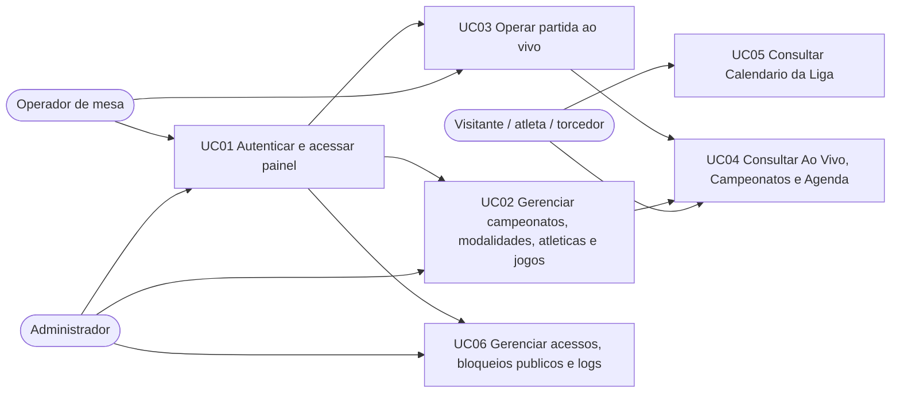
```mermaid
flowchart LR
  Administrador([Administrador])
  Operador([Operador de mesa])
  Visitante([Visitante / atleta / torcedor])

  UC01[UC01 Autenticar e acessar painel]
  UC02[UC02 Gerenciar campeonatos, modalidades, atleticas e jogos]
  UC03[UC03 Operar partida ao vivo]
  UC04[UC04 Consultar Ao Vivo, Campeonatos e Agenda]
  UC05[UC05 Consultar Calendario da Liga]
  UC06[UC06 Gerenciar acessos, bloqueios publicos e logs]

  Administrador --> UC01
  Administrador --> UC02
  Administrador --> UC06
  Operador --> UC01
  Operador --> UC03
  Visitante --> UC04
  Visitante --> UC05

  UC01 --> UC02
  UC01 --> UC03
  UC01 --> UC06
  UC02 --> UC04
  UC03 --> UC04
```

## 2.3 Requisitos Funcionais

Os requisitos funcionais a seguir foram sintetizados a partir do comportamento já documentado e da estrutura real do sistema:

- **RF01** — O sistema deve permitir que o usuário administrativo informe seu identificador de acesso antes da senha, para que o sistema resolva o estado da conta.
- **RF02** — O sistema deve permitir que o usuário administrativo com senha ativa realize autenticação e acesse o painel conforme suas permissões.
- **RF03** — O sistema deve permitir que o usuário administrativo com senha pendente defina uma nova senha no primeiro acesso antes de entrar no painel.
- **RF04** — O sistema deve permitir que administradores gerenciem campeonatos com código, nome, temporada, local padrão e status operacional.
- **RF05** — O sistema deve permitir que administradores alterem o status do campeonato entre planejamento, em breve, em andamento e encerrado.
- **RF06** — O sistema deve permitir que administradores gerenciem modalidades por campeonato, incluindo regra de resultado, desempate, pontuação, cartões e duração padrão de partida.
- **RF07** — O sistema deve permitir que administradores gerenciem atléticas com nome, cidade e divisão quando aplicável.
- **RF08** — O sistema deve permitir que administradores cadastrem, editem e excluam jogos com campeonato, temporada, modalidade, naipe, atléticas, local, quadra, data, horário e status.
- **RF09** — O sistema deve permitir que usuários com permissão de edição na aba de controle iniciem, atualizem e encerrem partidas ao vivo.
- **RF10** — O sistema deve permitir que o operador atualize placar por pontos ou por sets, conforme a regra da modalidade.
- **RF11** — O sistema deve permitir que o operador registre cartões por time quando a modalidade suportar essa regra.
- **RF12** — O sistema deve calcular automaticamente a classificação a partir dos jogos concluídos, segmentando o resultado por campeonato, temporada, modalidade, naipe e divisão.
- **RF13** — O sistema deve ordenar a classificação com base nas regras de desempate configuradas para a modalidade no contexto do campeonato.
- **RF14** — O sistema deve permitir a geração de fase de grupos por assistente de chaveamento com participantes, grupos, agenda e revisão.
- **RF15** — O sistema deve permitir a distribuição manual de atléticas nos grupos antes da confirmação da estrutura de chaveamento.
- **RF16** — O sistema deve gerar o mata-mata a partir da classificação dos grupos quando os pré-requisitos do chaveamento estiverem satisfeitos.
- **RF17** — O sistema deve permitir que o visitante consulte páginas públicas de Ao Vivo, Campeonatos, Agenda e Calendário da Liga.
- **RF18** — O sistema deve permitir que o visitante visualize classificação, chaveamento, jogos e eventos da liga nas páginas públicas compatíveis com o contexto selecionado.
- **RF19** — O sistema deve permitir que administradores configurem bloqueio global ou por página das áreas públicas e definam mensagem de manutenção.
- **RF20** — O sistema deve permitir que administradores gerenciem usuários, perfis e permissões por aba do painel administrativo.
- **RF21** — O sistema deve permitir que administradores consultem logs de auditoria com tipo de ação, recurso afetado, ator e período.
- **RF22** — O sistema deve refletir alterações operacionais relevantes nas páginas públicas em tempo quase real no estado atual apoiado por Supabase Realtime.
- **RF23** — O sistema deve manter rotas públicas principais para Home, Ao Vivo, Campeonatos, Agenda e Calendário da Liga, além das rotas administrativas de login e painel.
- **RF24** — O sistema deve, no estado-alvo, expor essas capacidades por meio de uma API dedicada em `laje-api`, preservando os contratos funcionais já consolidados no frontend.

## 2.4 Requisitos Não Funcionais

- **RNF01** — O sistema deve utilizar autenticação segura para acesso administrativo, com tratamento adequado de credenciais e sessão.
- **RNF02** — O sistema deve aplicar autorização por perfil e por aba do painel administrativo, impedindo edição sem permissão adequada.
- **RNF03** — O sistema deve manter interface responsiva para uso em desktop e dispositivos móveis.
- **RNF04** — O sistema deve fornecer feedback visual claro para carregamento, erro, confirmação e estados vazios.
- **RNF05** — O sistema deve buscar disponibilidade suficiente para uso operacional durante campeonatos e eventos da liga.
- **RNF06** — O sistema deve refletir atualizações críticas em janela compatível com uso real, com meta inicial de até cinco segundos após persistência do dado.
- **RNF07** — O sistema deve manter organização modular do código, separando páginas, componentes, hooks, domínio, repositórios e integrações.
- **RNF08** — O sistema deve versionar alterações de banco por migrations.
- **RNF09** — O sistema deve proteger variáveis de ambiente e segredos fora do código-fonte versionado.
- **RNF10** — O sistema deve manter, no estado atual, uma base mínima de qualidade com `build`, `lint` e testes automatizados executáveis no repositório principal.
- **RNF11** — O sistema deve evoluir para CI/CD estruturado no estado-alvo, preferencialmente com GitHub Actions e deploy controlado.
- **RNF12** — O sistema deve evoluir para observabilidade mais robusta no estado-alvo, com logs, métricas e visibilidade operacional do ambiente.
- **RNF13** — O sistema deve preservar manutenibilidade por meio de tipagem estática, centralização de enums e regras e documentação técnica alinhada ao produto.
- **RNF14** — O sistema deve preservar compatibilidade com estratégia de atualização quase em tempo real tanto no estado atual quanto no estado-alvo.
- **RNF15** — O sistema deve ser escalável para absorver novos módulos administrativos, novos campeonatos e futura expansão para outras ligas, sem comprometer a organização do domínio.

Observação de aderência:

- **Estado atual comprovado:** frontend React 18 + TypeScript + Vite, Tailwind, shadcn/ui, Supabase Auth, Postgres, funções SQL, Realtime e migrations.
- **Estado-alvo planejado:** backend dedicado `Node.js + Express`, PostgreSQL como persistência principal do desenho final, infraestrutura de hospedagem compatível com o Portfólio tendo AWS como referência inicial, CI/CD formal, análise estática e observabilidade ampliada.

## 2.5 Regras de Negócio

- Um campeonato possui status operacional e esse status influencia contexto padrão, visibilidade e ações disponíveis no sistema.
- Jogos pertencem a um campeonato, uma temporada, uma modalidade e um contexto competitivo que pode incluir naipe e divisão.
- A classificação é derivada dos jogos concluídos e não deve ser tratada como cadastro manual.
- As regras de pontuação, desempate, cartões e formato de placar dependem da configuração da modalidade no contexto do campeonato.
- O chaveamento depende de configuração prévia da edição, da distribuição dos grupos e dos resultados persistidos.
- O mata-mata só deve avançar quando existirem resultados definidos e, quando necessário, desempates resolvidos.
- Permissões administrativas controlam o acesso por aba do painel e distinguem pelo menos os níveis nenhum, visualizar e editar.
- Ações administrativas sensíveis devem gerar logs de auditoria.
- Páginas públicas podem ser bloqueadas globalmente ou individualmente por configuração administrativa.
- Eventos da liga são entidades próprias e independentes dos jogos, embora compartilhem o mesmo contexto institucional.
- Feriados e datas especiais, quando utilizados, são tratados em estrutura específica de calendário, distinta dos eventos da liga.
- Administradores autenticados podem contornar bloqueios públicos para fins operacionais e de revisão.

## 2.6 Fora do Escopo

Neste ciclo, não fazem parte do escopo principal:

- aplicativo mobile nativo;
- pagamentos;
- inscrição automática de atletas;
- streaming de jogos;
- módulo disciplinar completo;
- gestão financeira;
- marketplace;
- IA generativa como funcionalidade central do produto;
- integração com federações externas;
- automação completa de regulamentos esportivos específicos além das regras já refletidas no domínio atual.

---

# 3. Fluxos e Comportamento do Sistema

## 3.1 Fluxo Principal do Usuário

### Contexto 1 — Usuário público

O usuário público acessa a página inicial, navega para as páginas de Ao Vivo, Campeonatos, Agenda ou Calendário da Liga e consome informações que refletem o estado operacional persistido do sistema. Quando a página não está bloqueada, o visitante pode acompanhar resultados, classificação, chaveamento e eventos sem necessidade de treinamento prévio.

### Contexto 2 — Administrador ou operador

O administrador ou operador também pode navegar pelas páginas públicas do sistema. Quando precisa atuar na operação interna, acessa a rota de login, informa seu identificador, autentica-se conforme o estado da conta, entra no painel administrativo e executa ações compatíveis com seu perfil e com as permissões da aba selecionada. Entre essas ações estão gestão de jogos, controle ao vivo, conferência de súmula, sorteios, eventos da liga, usuários, logs, status do campeonato, conta e configurações. No fluxo crítico de operação ao vivo, seleciona um jogo, atualiza placar, sets e cartões, e o sistema persiste os dados, recalcula derivados quando necessário e reflete o resultado para as páginas públicas.

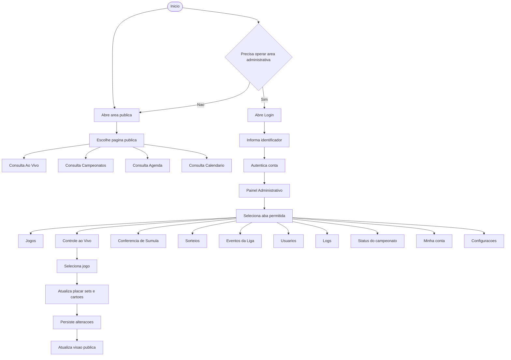
```mermaid
flowchart TD
  Inicio([Inicio]) --> NavegacaoPublica[Abre area publica]
  NavegacaoPublica --> EscolhaPublica[Escolhe pagina publica]
  EscolhaPublica --> AoVivo[Consulta Ao Vivo]
  EscolhaPublica --> Campeonatos[Consulta Campeonatos]
  EscolhaPublica --> Agenda[Consulta Agenda]
  EscolhaPublica --> Calendario[Consulta Calendario]

  Inicio --> AcessoAdmin{Precisa operar area administrativa}
  AcessoAdmin -->|Sim| Login[Abre Login]
  AcessoAdmin -->|Nao| NavegacaoPublica
  Login --> Identificador[Informa identificador]
  Identificador --> Autenticacao[Autentica conta]
  Autenticacao --> Painel[Painel Administrativo]
  Painel --> Abas[Seleciona aba permitida]
  Abas --> Jogos[Jogos]
  Abas --> Controle[Controle ao Vivo]
  Abas --> Sumula[Conferencia de Sumula]
  Abas --> Sorteios[Sorteios]
  Abas --> Eventos[Eventos da Liga]
  Abas --> Usuarios[Usuarios]
  Abas --> Logs[Logs]
  Abas --> Status[Status do campeonato]
  Abas --> Conta[Minha conta]
  Abas --> Configuracoes[Configuracoes]
  Controle --> SelecionaJogo[Seleciona jogo]
  SelecionaJogo --> AtualizaPartida[Atualiza placar sets e cartoes]
  AtualizaPartida --> Persistencia[Persiste alteracoes]
  Persistencia --> Publicacao[Atualiza visao publica]
```

## 3.2 Fluxos Alternativos

- **Usuário sem permissão tenta acessar o painel:** o sistema redireciona para login ou bloqueia o acesso após autenticação sem perfil válido.
- **Visitante acessa página bloqueada:** o sistema exibe mensagem de manutenção quando houver bloqueio global ou bloqueio específico da rota.
- **Jogo ainda não possui resultado:** a classificação e a progressão da chave permanecem dependentes de conclusão da partida.
- **Empate pendente impede geração do mata-mata:** o fluxo de chaveamento exige resolução prévia do contexto de desempate quando aplicável.
- **Erro ao salvar placar:** o sistema deve informar falha operacional e evitar que a interface assuma persistência bem-sucedida sem confirmação.
- **Falha de autenticação:** o sistema exibe mensagem de erro e mantém o usuário fora do painel.
- **Ausência de campeonato ativo ou priorizado:** as páginas públicas e administrativas devem recorrer ao contexto disponível sem inventar um campeonato padrão inexistente.

---

# 4. Mockups e Experiência do Usuário

Como já existem telas implementadas no repositório, esta seção utiliza as telas atuais como base de mockup funcional da solução. Os pontos abaixo documentam a navegação e reservam espaço para inclusão de prints em revisão posterior.

## 4.1 Fluxo de Navegação

A navegação principal do projeto está organizada em duas áreas:

- **Área pública:** `/`, `/ao-vivo`, `/campeonatos`, `/agenda`, `/calendario-da-liga`.
- **Área administrativa:** `/login` e `/admin`.

O sistema também mantém redirecionamentos para rotas legadas de páginas públicas.

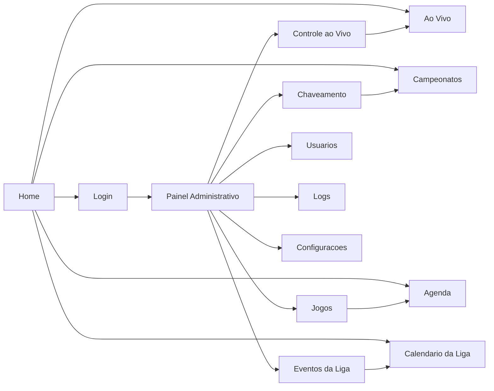
```mermaid
flowchart LR
  Inicio[Home] --> AoVivo[Ao Vivo]
  Inicio --> Campeonatos[Campeonatos]
  Inicio --> Agenda[Agenda]
  Inicio --> Calendario[Calendario da Liga]
  Inicio --> Login[Login]

  Login --> Painel[Painel Administrativo]
  Painel --> Controle[Controle ao Vivo]
  Painel --> Jogos[Jogos]
  Painel --> Chaveamento[Chaveamento]
  Painel --> Eventos[Eventos da Liga]
  Painel --> Usuarios[Usuarios]
  Painel --> Logs[Logs]
  Painel --> Configuracoes[Configuracoes]

  Controle --> AoVivo
  Jogos --> Agenda
  Chaveamento --> Campeonatos
  Eventos --> Calendario
```

## 4.2 Wireframes ou Mockups das Telas

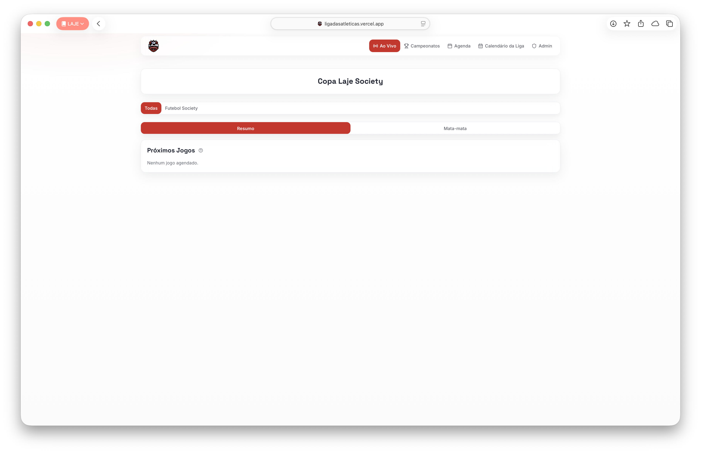

- **Finalidade:** concentrar jogos em andamento, jogos em breve, jogos finalizados e contexto competitivo associado.
- **Ações principais do usuário:** acompanhar partidas, consultar classificação, visualizar chaveamento e filtrar informações por contexto.
- **Tipo de usuário:** público geral, atletas, representantes de atlética e operadores em conferência.

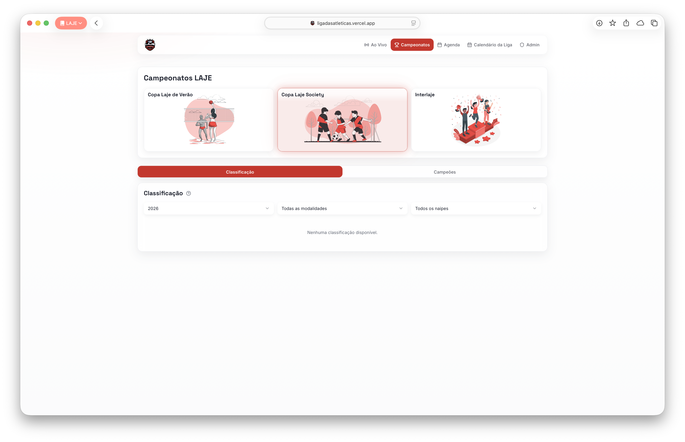

- **Finalidade:** apresentar visão histórica e institucional dos campeonatos por temporada.
- **Ações principais do usuário:** selecionar campeonato, trocar temporada, consultar tabela e visualizar a chave.
- **Tipo de usuário:** público geral e organização da liga.

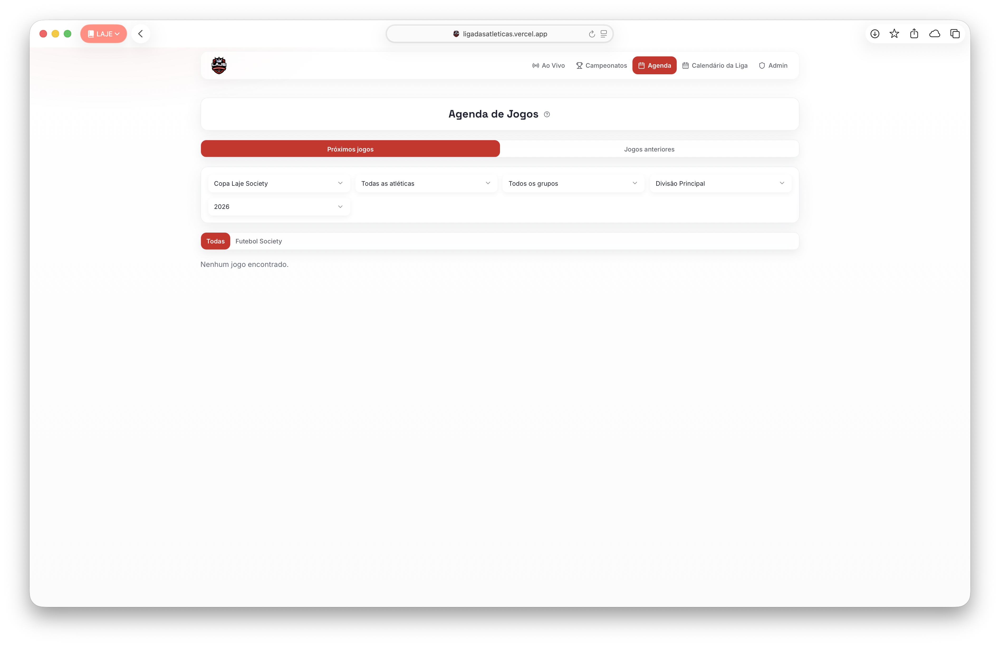

- **Finalidade:** organizar os jogos agendados por data e contexto esportivo.
- **Ações principais do usuário:** consultar partidas futuras, filtrar por campeonato e modalidade e verificar local e horário.
- **Tipo de usuário:** público geral, atletas e organização.

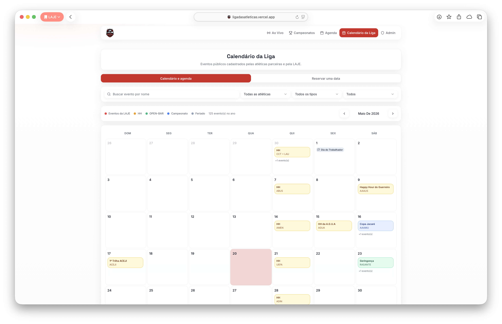

- **Finalidade:** consolidar eventos institucionais da liga além dos jogos.
- **Ações principais do usuário:** consultar eventos por mês, pesquisar e filtrar por tipo ou organização.
- **Tipo de usuário:** público geral, representantes de atlética e administradores.

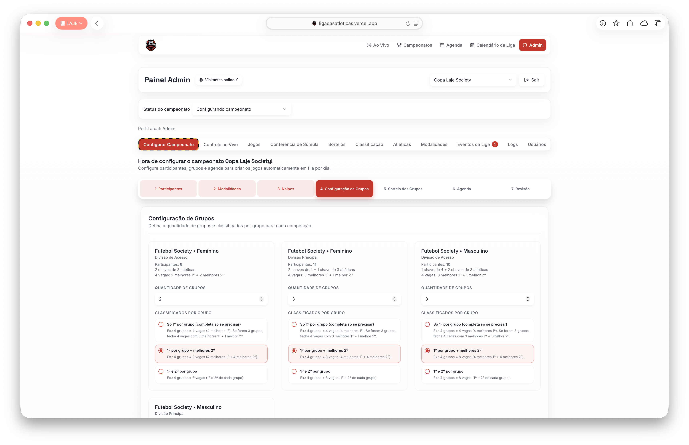

- **Finalidade:** centralizar a operação administrativa do sistema.
- **Ações principais do usuário:** navegar por abas, gerenciar dados, revisar permissões e acompanhar indicadores operacionais.
- **Tipo de usuário:** administradores e operadores autorizados.

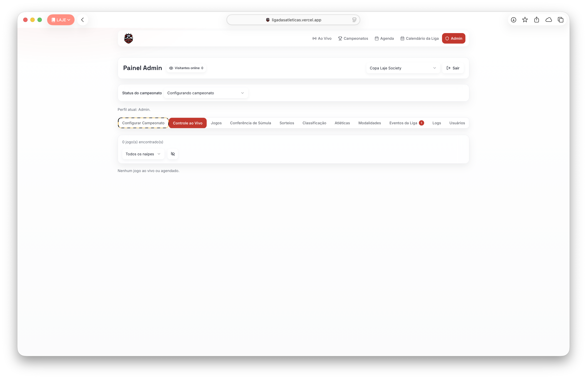

- **Finalidade:** operar partidas em andamento com atualização rápida de status e placar.
- **Ações principais do usuário:** iniciar jogo, atualizar placar, registrar sets e cartões e encerrar a partida.
- **Tipo de usuário:** operador de mesa e administrador com permissão de edição.

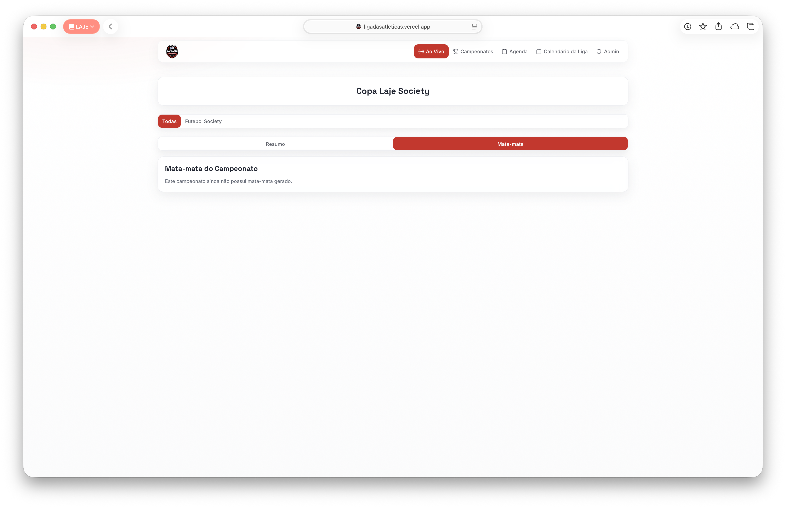

- **Finalidade:** visualizar fase de grupos e mata-mata com contexto de progressão.
- **Ações principais do usuário:** acompanhar grupos, confrontos e vencedores por temporada.
- **Tipo de usuário:** público geral e organização esportiva.

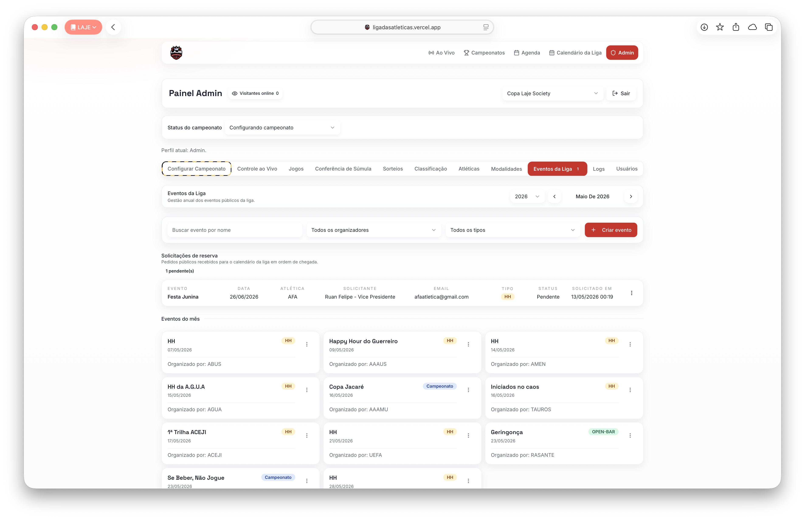

- **Finalidade:** representar a gestão e a consulta dos eventos institucionais no calendário.
- **Ações principais do usuário:** cadastrar ou consultar eventos, local e organização responsável.
- **Tipo de usuário:** administradores e visitantes da área pública.

## 4.3 Fluxo de Interação do Usuário

Foi selecionado o fluxo de **operação de partida ao vivo**, por ser um dos cenários mais críticos do sistema.

### Sequência textual

1. O usuário administrativo acessa o login administrativo.
2. O sistema resolve o estado da conta, autentica o usuário e valida seu perfil.
3. O usuário entra no painel administrativo e seleciona a aba de Controle ao Vivo.
4. O sistema carrega as partidas do contexto selecionado, com base em campeonato, temporada e filtros disponíveis.
5. O operador seleciona a partida e inicia a operação do jogo.
6. Durante a partida, o operador atualiza placar, sets, cartões e status conforme a modalidade.
7. O sistema valida e persiste as alterações no ambiente atual de dados.
8. Após a persistência, o sistema reflete o novo estado nas páginas públicas e atualiza dados derivados, como classificação e chaveamento, quando aplicável.

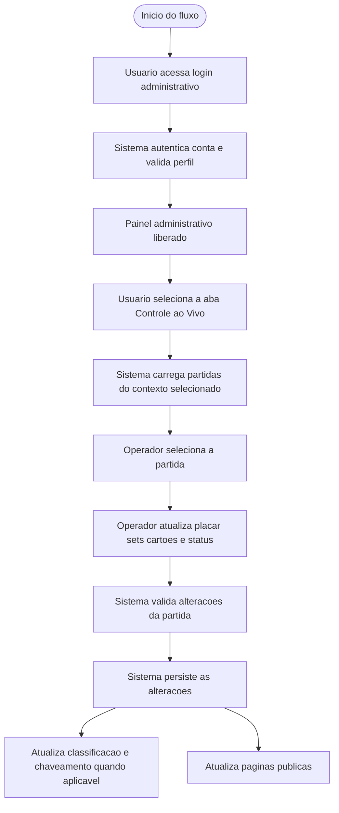
```mermaid
flowchart TD
  Inicio([Inicio do fluxo]) --> Login[Usuario acessa login administrativo]
  Login --> Autenticacao[Sistema autentica conta e valida perfil]
  Autenticacao --> Painel[Painel administrativo liberado]
  Painel --> Controle[Usuario seleciona a aba Controle ao Vivo]
  Controle --> Contexto[Sistema carrega partidas do contexto selecionado]
  Contexto --> Partida[Operador seleciona a partida]
  Partida --> Atualizacao[Operador atualiza placar sets cartoes e status]
  Atualizacao --> Validacao[Sistema valida alteracoes da partida]
  Validacao --> Persistencia[Sistema persiste as alteracoes]
  Persistencia --> Derivados[Atualiza classificacao e chaveamento quando aplicavel]
  Persistencia --> Publicacao[Atualiza paginas publicas]
```

## 4.4 Feedback Inicial de Usuários

As evidências já registradas na etapa 1 desta RFC indicam validação inicial de valor por parte de participantes da LAJE durante interações reais em 2026. Os principais sinais documentados foram:

- percepção positiva sobre tabela e organização das informações;
- comentários espontâneos indicando boa aceitação da proposta;
- questionamento direto sobre funcionalidade de pontuação, evidenciando aderência ao problema real;
- percepção de potencial de expansão da solução para outras ligas;
- necessidade de onboarding ou melhor apoio inicial ao uso administrativo, refletida na observação de que seria necessário ensinar o uso da ferramenta.

Nesta etapa, esses elementos são tratados como **feedback inicial qualitativo**, ainda sem substituir uma rodada formal de avaliação com usuários e sem ampliar as evidências além do que já está documentado.

---

# 5. Arquitetura do Sistema

## 5.1 Diagrama C4

Para evitar ambiguidade entre a arquitetura já implementada e a arquitetura pretendida para aderência ao Portfólio, esta subseção adota a seguinte convenção:

- **estado atual:** o sistema opera com frontend React/Vite integrado ao ecossistema Supabase, que hoje concentra autenticação, persistência relacional, funções SQL e atualização quase em tempo real;
- **estado-alvo:** os diagramas de containers e componentes representam a evolução arquitetural prevista para o TCC/Portfólio, com frontend web consumindo backend dedicado e banco PostgreSQL em infraestrutura de hospedagem compatível com as diretrizes da linha de Web Apps.

### Nível 1 — Contexto

O diagrama de contexto mostra o LAJE App como sistema central do produto, evidenciando as principais personas que interagem com ele e o papel do sistema na operação da liga e no acompanhamento público dos campeonatos.

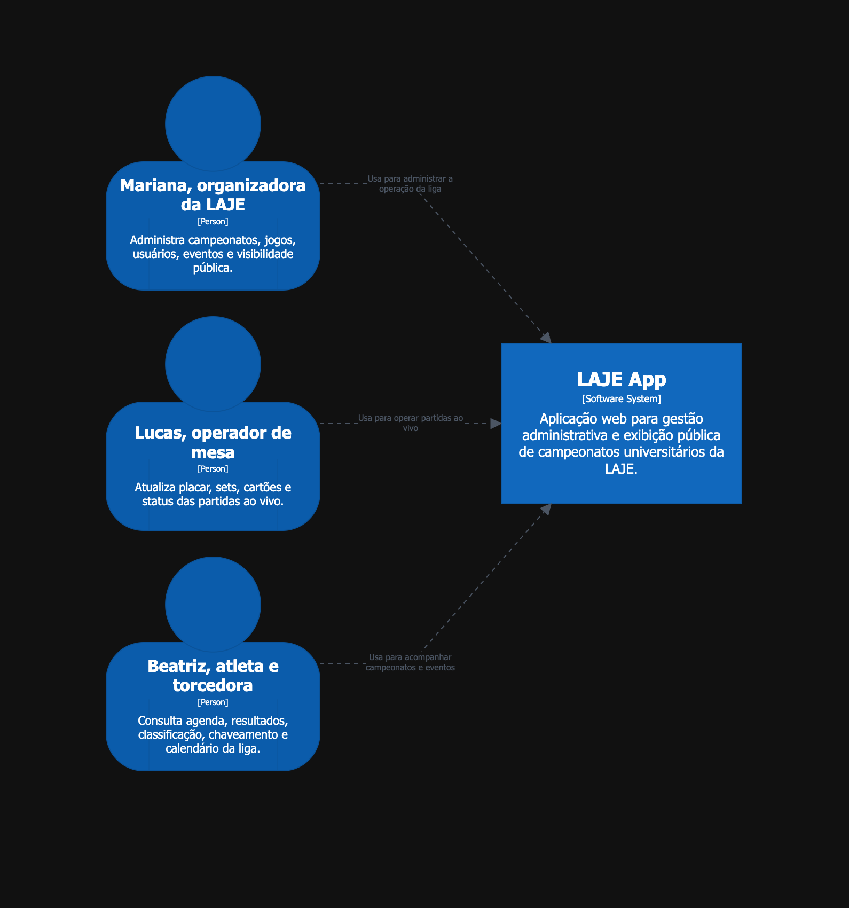

### Nível 2 — Containers

O diagrama de containers abaixo representa o **estado-alvo** da solução, no qual o frontend web passa a consumir backend dedicado e banco PostgreSQL. A decisão de hospedagem permanece descrita no texto da RFC, tendo AWS como referência inicial registrada na etapa 1, sem transformar a infraestrutura em container funcional do sistema.

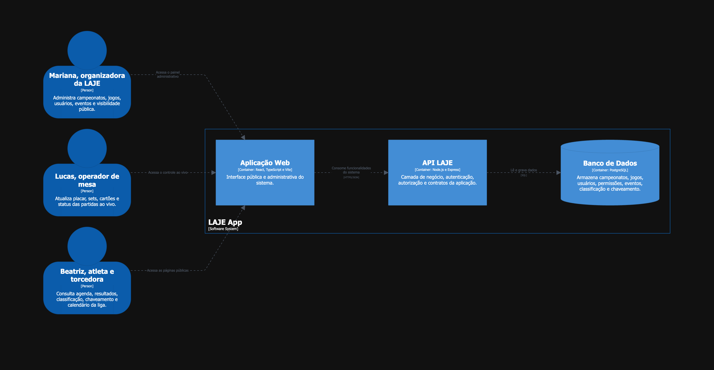

### Nível 3 — Componentes

O nível de componentes abaixo representa uma **arquitetura-alvo de referência** para o backend `laje-api`, organizada a partir dos módulos funcionais já evidenciados pelo domínio atual do projeto. Como o backend dedicado ainda não está implementado neste repositório, o diagrama deve ser lido como decomposição lógica prevista, e não como reflexo literal de arquivos já existentes.

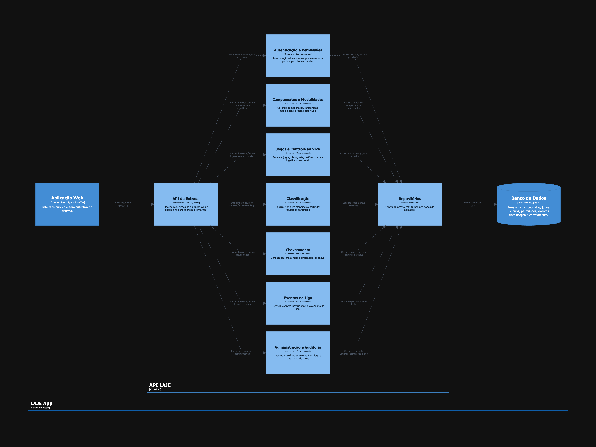

## 5.2 Modelo de Dados

O modelo de dados atual é relacional e já evidencia entidades centrais do domínio esportivo. A seguir, estão destacadas as principais estruturas identificadas no schema tipado do Supabase e na documentação:

- `championships`
- `championship_sports`
- `matches`
- `standings`
- `championship_bracket_editions`
- `championship_bracket_groups`
- `championship_bracket_matches`
- `teams`
- `sports`
- `league_events`
- `league_event_organizer_teams`
- `admin_profiles`
- `admin_profile_permissions`
- `admin_user_profiles`
- `admin_action_logs`
- `public_page_access_settings`

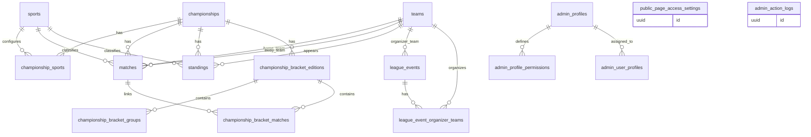
```mermaid
erDiagram
  championships ||--o{ championship_sports : has
  championships ||--o{ matches : has
  championships ||--o{ standings : has
  championships ||--o{ championship_bracket_editions : has

  sports ||--o{ championship_sports : configures
  sports ||--o{ matches : classifies
  sports ||--o{ standings : classifies

  teams ||--o{ matches : home_team
  teams ||--o{ matches : away_team
  teams ||--o{ standings : appears
  teams ||--o{ league_events : organizer_team
  teams ||--o{ league_event_organizer_teams : organizes

  championship_bracket_editions ||--o{ championship_bracket_groups : contains
  championship_bracket_editions ||--o{ championship_bracket_matches : contains
  matches ||--o{ championship_bracket_matches : links

  league_events ||--o{ league_event_organizer_teams : has

  admin_profiles ||--o{ admin_profile_permissions : defines
  admin_profiles ||--o{ admin_user_profiles : assigned_to

  public_page_access_settings {
    uuid id
  }

  admin_action_logs {
    uuid id
  }
```

Em leitura funcional:

- `championships`, `championship_sports`, `sports` e `teams` formam a base configurável dos campeonatos.
- `matches` é a entidade operacional central.
- `standings` representa dado derivado a partir dos resultados persistidos.
- `championship_bracket_editions`, `championship_bracket_groups` e `championship_bracket_matches` sustentam a estrutura da chave.
- `league_events` e `league_event_organizer_teams` representam o calendário institucional da liga.
- `admin_profiles`, `admin_profile_permissions` e `admin_user_profiles` sustentam autorização por perfil e por aba.
- `admin_action_logs` registra auditoria de ações sensíveis.
- `public_page_access_settings` controla disponibilidade pública global e por rota.

Compatibilidade com o código e com o schema atual:

- a existência de `championships`, `matches`, `championship_bracket_editions` e das rotas públicas/admin é sustentada diretamente pelo uso dessas tabelas no frontend atual;
- `league_events`, `teams`, `sports`, `standings` e `championship_sports` também aparecem em hooks e repositórios reais do projeto;
- no schema tipado, `admin_profile_permissions.profile_id` e `admin_user_profiles.profile_id` referenciam `admin_profiles.id`, então a parte administrativa do diagrama é compatível com o modelo atual;
- `league_event_organizer_teams` referencia tanto `league_events` quanto `teams`, e `league_events` ainda possui um `organizer_team_id` opcional, por isso a relação com `teams` não pode ser omitida;
- `admin_action_logs` e `public_page_access_settings` existem como estruturas relevantes, mas não aparecem no schema tipado com relacionamentos fortes para outras tabelas; por isso ficam como entidades mais isoladas neste ER simplificado.

## 5.3 Principais Componentes

### Frontend público

Responsável por Home, Ao Vivo, Campeonatos, Agenda e Calendário da Liga, com foco em navegação, consulta e atualização da informação consumida pelo público.

### Painel administrativo

Centraliza jogos, controle ao vivo, modalidades, atléticas, eventos, usuários, logs, conta, configurações e demais abas disponíveis conforme perfil.

### Backend API

No estado-alvo, concentrará autenticação, autorização, regras de negócio, contratos do sistema e orquestração de persistência, reduzindo acoplamento da lógica crítica ao frontend.

### Autenticação e autorização

No estado atual, é apoiada por Supabase Auth, perfis administrativos, permissões por aba e validações server-side ou no banco. No estado-alvo, a mesma responsabilidade deve ser preservada em backend dedicado.

### Controle ao vivo

Abrange o fluxo operacional de atualização de status da partida, placar, sets, cartões e publicação quase em tempo real para as páginas públicas.

### Classificação

Componente derivado que recalcula estatísticas e ordenação a partir dos resultados das partidas, respeitando regra esportiva e critérios de desempate.

### Chaveamento

Abrange geração de grupos, distribuição de atléticas, agenda inicial, formação do mata-mata e progressão automática dos confrontos.

### Eventos e calendário

Gerencia eventos institucionais da liga, filtragem pública e associação de atléticas organizadoras, mantendo separação conceitual em relação aos jogos.

### Auditoria

Registra ações administrativas relevantes para rastreabilidade, incluindo alterações de dados sensíveis e eventos de login.

### Persistência

No estado atual, utiliza Supabase Postgres, schema versionado e funções SQL. No estado-alvo, o desenho final continua relacional, com PostgreSQL como pilar principal da persistência.

### Tempo quase real

No estado atual, utiliza recursos de Realtime e Presence do ecossistema Supabase. No estado-alvo, essa capacidade permanece obrigatória do ponto de vista funcional, ainda que a tecnologia definitiva possa evoluir.

## 5.4 Stack Tecnológica

### Estado atual

**React 18**  
Escolhido para estruturar a interface web em componentes reutilizáveis, tanto no domínio público quanto no painel administrativo.

**TypeScript**  
Escolhido para reforçar tipagem estática, consistência de contratos e manutenção do código do frontend.

**Vite**  
Escolhido como bundler e ambiente de desenvolvimento rápido para a aplicação web.

**Tailwind CSS**  
Escolhido para composição utilitária da interface e aceleração do desenvolvimento visual.

**shadcn/ui**  
Escolhido como base de componentes reutilizáveis, em conjunto com Radix UI, para consistência de interface e produtividade.

**Supabase**  
Escolhido no estado atual como base de autenticação, persistência relacional, funções SQL, Realtime e Presence, sustentando a operação já implementada.

### Estado-alvo

**React 18 + TypeScript + Vite**  
Mantidos pela aderência já comprovada à construção da interface e pela boa separação entre estado de UI, rotas e domínio. O Vite permanece como bundler e ambiente de desenvolvimento rápido do frontend, sem alteração em relação ao estado atual.

**Tailwind CSS + shadcn/ui**  
Mantidos no estado-alvo. A camada visual da aplicação — composição utilitária de estilos e biblioteca de componentes baseada em Radix UI — não sofre alteração com a migração arquitetural do backend. A transição de Supabase para `laje-api` é transparente para a stack de UI.

**Node.js + Express**  
Previstos para o backend dedicado `laje-api`, concentrando autenticação, autorização, regras de negócio e contratos do sistema em camada própria.

**PostgreSQL**  
Previsto como banco relacional principal do desenho final por oferecer integridade de dados, consultas estruturadas e aderência ao domínio transacional do projeto.

**Infraestrutura de hospedagem compatível com o Portfólio**  
Prevista para sustentar frontend, backend e banco relacional fora do Supabase. A etapa 1 registra AWS como referência de estado-alvo, mas a escolha final deve permanecer dentro dos provedores e modelos de hospedagem permitidos pelas diretrizes do Portfólio.

**GitHub Actions**  
Previsto para estruturar CI/CD, reforçando build, lint, testes e automação de deploy nas próximas etapas.

**Ferramenta de análise estática**  
Prevista para reforçar qualidade contínua, padronização e prevenção de regressões técnicas. Nesta etapa, o repositório já possui lint local, mas a formalização dessa esteira ainda é evolução planejada.

**Ferramenta de observabilidade**  
Prevista para ampliar logs, métricas e monitoramento do ambiente implantado, especialmente em cenários de operação ao vivo e suporte.

---

# 6. Segurança e Privacidade

No estado atual, o LAJE App já utiliza autenticação administrativa apoiada em Supabase Auth, permissões por perfil e por aba do painel, políticas de acesso no banco e logs administrativos para rastreabilidade. Esses pontos cobrem as preocupações básicas de segurança hoje evidenciadas no repositório, na Wiki e nas migrations.

Também fazem parte do estado atual do sistema:

- uso de variáveis de ambiente no frontend para configuração do Supabase;
- controle de acesso ao painel por perfil e nível de permissão;
- registros de auditoria para ações administrativas relevantes;
- atualização quase em tempo real em fluxos que dependem do estado persistido das partidas.

No estado-alvo, a evolução já registrada nesta RFC e na Wiki é concentrar autenticação, autorização e regras críticas no backend dedicado `laje-api`, preservando PostgreSQL como persistência principal e reforçando a solução com CI/CD, análise estática e observabilidade. A preocupação com riscos como controle de acesso inadequado, exposição indevida de dados e configuração insegura permanece como requisito de evolução, sem afirmar mecanismos que ainda não existam no aplicativo atual.

## 6.1 Privacidade e LGPD

Com base nas estruturas e fluxos documentados no app e na Wiki, o sistema trata principalmente:

- **dados administrativos:** nome, identificador de login, perfil, permissões, status de senha e último acesso;
- **dados operacionais:** campeonatos, modalidades, atléticas, jogos, placares, cartões, eventos, classificação, chaveamento e logs de ações administrativas;
- **dados públicos:** informações de partidas, resultados, agenda, calendário, classificação e chaveamento disponibilizadas para visitantes;
- **dados técnicos:** registros de auditoria, contexto de autenticação, metadados operacionais e informações necessárias para a operação atual e para a observabilidade prevista no estado-alvo.

Pelo escopo atualmente implementado e documentado, o sistema não foi projetado para tratar dados sensíveis de saúde, biometria, pagamentos ou informações acadêmicas privadas.

No estado atual, esses dados ficam apoiados na estrutura já utilizada pelo app com Supabase Auth, Supabase/Postgres e funções SQL. No estado-alvo, a persistência principal continua relacional em PostgreSQL, com acesso mediado pelo backend dedicado `laje-api`.

Nesta etapa, a RFC registra o tema de privacidade e LGPD como preocupação de conformidade do projeto, mas não afirma a existência de uma política formal já implantada para retenção, anonimização ou remoção de dados. O que está evidenciado no estado atual é que o painel permite correção de dados operacionais e que o sistema mantém logs e estruturas de autenticação voltados a controle de acesso e rastreabilidade.

Para o estado-alvo, a expectativa documentada é manter a coleta restrita ao necessário para os fluxos do produto e definir com mais formalidade como o usuário poderá solicitar revisão ou remoção de dados, quando aplicável, dentro da arquitetura futura com `laje-api`.

---

# 7. Planejamento do Projeto

O planejamento abaixo combina marcos históricos do repositório, edições relevantes da própria RFC, validações já realizadas com usuários finais e os próximos passos da evolução técnica e documental do projeto. As datas históricas foram ancoradas no histórico Git do projeto e do arquivo `docs/Documentation_RFC.md`. As datas de validação com usuários finais foram ancoradas nas datas finais registradas no sistema para a Copa Laje de Verão e para a Copa Laje Society.

| Marco | Descrição | Data |
|---|---|---|
| M1 | Criação da base inicial do projeto no repositório | 01/01/2025 |
| M2 | Criação inicial do documento RFC do LAJE App | 09/04/2026 |
| M3 | Revisão da RFC para explicitar o estado-alvo de entrega e a arquitetura futura | 09/04/2026 |
| M4 | Ajuste da RFC para registrar com mais clareza o estado atual com React e Supabase, além de metas iniciais | 10/04/2026 |
| M5 | Validação com usuários finais durante a Copa Laje de Verão | 12/04/2026 |
| M6 | Consolidação da RFC técnica com os capítulos 1 a 5 | 24/05/2026 |
| M7 | Ajustes pontuais da RFC para refletir a evolução funcional do app | 28/05/2026 |
| M8 | Validação com usuários finais durante a Copa Laje Society | 21/06/2026 |
| M9 | Complementação da RFC com as seções 6 a 10 e revisão de aderência ao modelo oficial | 23/06/2026 |
| M10 | Consolidação final da RFC alinhada ao app, à Wiki e ao modelo oficial | 29/06/2026 |
| M11 | Planejamento técnico da refatoração para `laje-api` | 27/07/2026 |
| M12 | Estrutura inicial do backend dedicado com PostgreSQL e autenticação base | 17/08/2026 |
| M13 | Migração dos fluxos centrais do produto para a arquitetura-alvo | 21/09/2026 |
| M14 | CI/CD, análise estática, observabilidade e evolução de testes | 19/10/2026 |
| M15 | Preparação do ambiente público, documentação final e demonstração | 09/11/2026 |

---

# 8. Referências

- Católica SC Portfolio. [The Portfolio Playbook](https://github.com/CatolicaSC-Portfolio/The-Portfolio-Playbook/?tab=readme-ov-file).
- Católica SC Portfolio. [PAC Extensionista VII](https://github.com/CatolicaSC-Portfolio/The-Portfolio-Playbook/blob/main/PAC%20Extensionista%20VII.md).
- Católica SC Portfolio. [Portfólio Directions — Geral](https://github.com/CatolicaSC-Portfolio/The-Portfolio-Playbook/blob/main/directions/portfolio-directions-GERAL.md).
- Católica SC Portfolio. [Portfólio Directions — Web Apps](https://github.com/CatolicaSC-Portfolio/The-Portfolio-Playbook/blob/main/directions/portfolio-directions-webapp.md).
- Católica SC Portfolio. [Diretrizes de Avaliação para Professores](https://github.com/CatolicaSC-Portfolio/The-Portfolio-Playbook/blob/main/documentation/diretrizes-avaliacao-professores.md).
- Católica SC Portfolio. [Normas e Regulamentações](https://github.com/CatolicaSC-Portfolio/The-Portfolio-Playbook/blob/main/documentation/normas.md).
- Católica SC Portfolio. [Modelo de RFC](https://github.com/CatolicaSC-Portfolio/The-Portfolio-Playbook/blob/main/documentation/RFC/modelo-de-RFC.md).
- WINCK, Diogo Vinícius. [Mais Que Código](https://medium.com/@diogo.winck/mais-que-c%C3%B3digo-541676f3d78d). Medium.
- WINCK, Diogo Vinícius. [O TCC além do TCC](https://medium.com/@diogo.winck/o-tcc-al%C3%A9m-do-tcc-86f539650527). Medium.
- LAJE App. [README](../README.md).
- LAJE App. [Requisitos Funcionais e Não Funcionais](./Functional_and_non_functional_requirements.md).
- LAJE App. [Histórias de Usuário e Critérios de Aceite](./User_stories_and_acceptance_criteria.md).
- LAJE App. Wiki do projeto: [Home](https://github.com/jaooduartte/laje/wiki), [Arquitetura](https://github.com/jaooduartte/laje/wiki/Arquitetura), [Fluxos do Sistema](https://github.com/jaooduartte/laje/wiki/Fluxos-do-Sistema), [Modelagem de Dados](https://github.com/jaooduartte/laje/wiki/Modelagem-de-Dados), [Requisitos do Sistema](https://github.com/jaooduartte/laje/wiki/Requisitos-do-Sistema) e [Histórias de Usuário](https://github.com/jaooduartte/laje/wiki/Hist%C3%B3rias-de-Usu%C3%A1rio).
- React. [Documentação oficial](https://react.dev/).
- TypeScript. [Documentação oficial](https://www.typescriptlang.org/docs/).
- Vite. [Documentação oficial](https://vite.dev/).
- Tailwind CSS. [Documentação oficial](https://tailwindcss.com/docs).
- shadcn/ui. [Documentação oficial](https://ui.shadcn.com/).
- Supabase. [Documentação oficial](https://supabase.com/docs).
- PostgreSQL. [Documentação oficial](https://www.postgresql.org/docs/).
- Express. [Documentação oficial](https://expressjs.com/).

---

# 9. Apêndices

Podem ser consultados como material complementar desta RFC:

- evidências visuais em `docs/assets`, incluindo as telas de Ao Vivo, Campeonatos, Agenda, Calendário da Liga, Painel Admin, Controle ao Vivo, Chaveamento e Eventos da Liga;
- evidências de feedback inicial em `docs/assets/reviews`;
- documentos complementares do projeto em `docs/Functional_and_non_functional_requirements.md` e `docs/User_stories_and_acceptance_criteria.md`;
- versões exportadas da RFC em `docs/Documentation_RFC.pdf`, `docs/LAJE_RFC_v1.docx` e `docs/LAJE_RFC_v2.docx`;
- Wiki do projeto como documentação funcional e técnica contínua.
